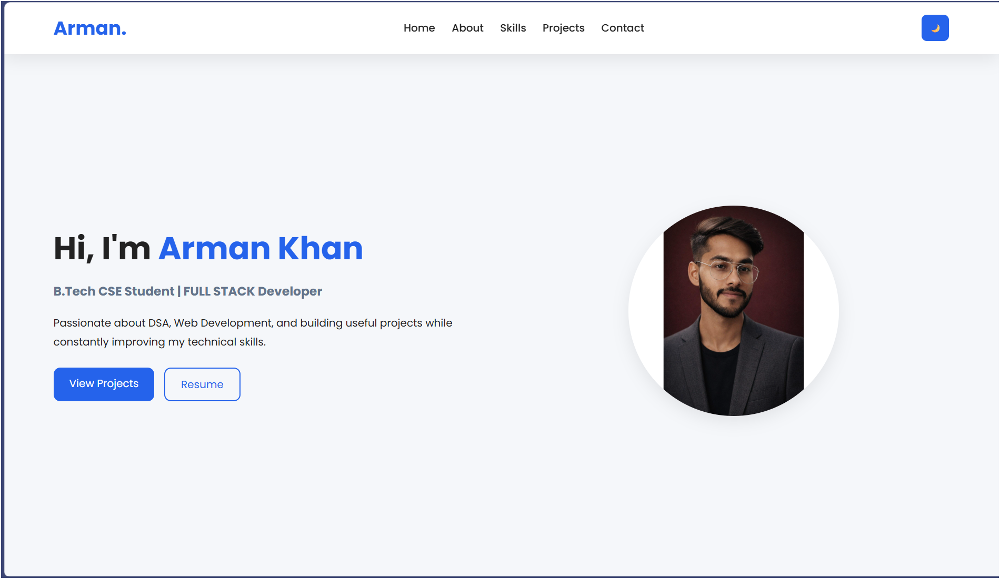
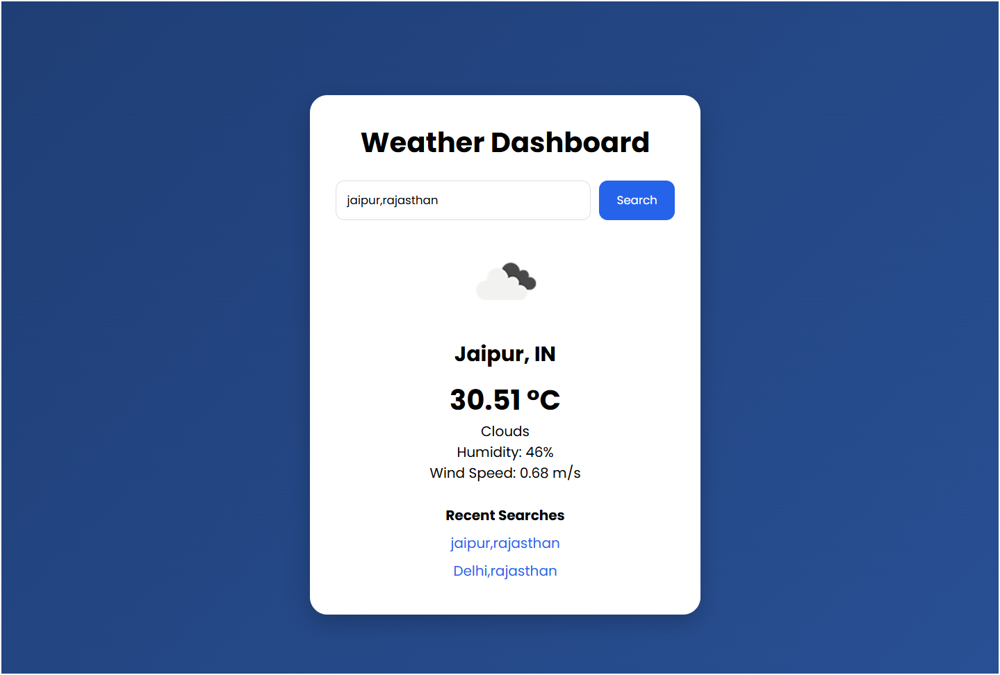

# INTERNSHIP-PROJECTS

This repository contains web development projects developed as part of the Internova Labs Web Development Program.

## Projects Included

### 1. Personal Portfolio Website

A responsive personal portfolio website built to showcase my skills, projects, and achievements.

#### Features

* Responsive design
* Dark/Light mode
* Smooth scrolling
* Skills showcase
* Project showcase
* Contact section

#### Technologies Used

* HTML
* CSS
* JavaScript

---

### 2. Weather Dashboard

A weather application that provides real-time weather information using the OpenWeather API.

#### Features

* Search weather by city
* Real-time temperature data
* Humidity information
* Wind speed information
* Weather condition display
* Recent search history
* Responsive design

#### Technologies Used

* HTML
* CSS
* JavaScript
* OpenWeather API

---

## Folder Structure

```text
INTERNSHIP-PROJECTS
│
├── Portfolio-Website
│   ├── assets
│   ├── index.html
│   ├── style.css
│   ├── script.js
│   └── README.md
│
├── Weather-Dashboard
│   ├── assets
│   ├── index.html
│   ├── style.css
│   ├── script.js
│   └── README.md
│
└── README.md
```

## Learning Outcomes

* Responsive Web Design
* DOM Manipulation
* API Integration
* Local Storage Usage
* Modern UI Development
* Git & GitHub Workflow

## Author

**Arman Khan**

B.Tech Computer Science Engineering
JECRC Foundation, Jaipur

GitHub: https://github.com/Arman2404

LinkedIn: https://www.linkedin.com/in/armank2404

## Screenshots

### Portfolio Website



### Weather Dashboard

